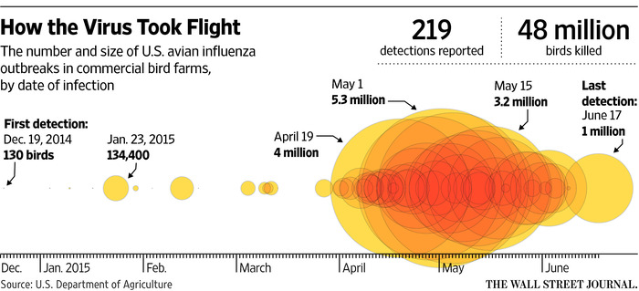
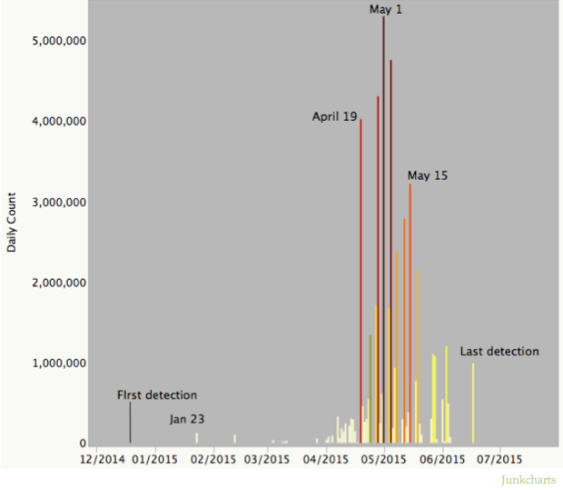

Ce travail est inspiré de l'article [hrbrmstr](http://rud.is/b/2015/10/24/less-drama-more-encoding/), lui même inspiré par un article du [Wall Street Journal](http://www.wsj.com/articles/u-s-readies-for-a-return-of-bird-flu-1444665965) concernant la circulation de __virus aviaire pathogènes__ dans les élevages US et illustré par un graphique accrocheur (Quite the eye-catching chart)



Le graphique est spectaculaire mais difficile à appréhender. L'objectif de l'auteur est de le transformer en barre graphe, moins tape à l'oeil mais plus informatif.



Reprendre ce travail m'a permis de:

- apprendre à extraire un tableau de données à partir d'une page HTML
- découvrir la librairy __viridis__ (palette de couleur)
- de tansformer des formats de dates en modifiant la LOCALE de mon ordinateur
- de manipuler la librairie dplyr

Library nécessaires
-------------------

```{r}
library(xml2)
library(rvest)
library(dplyr)
library(stringr)
library(ggplot2)
library(scales)
library(viridis)
library(ggthemes)

```

Récupérer les données source
----------------------------

Les données de base (raw data) sont issues de l'USDA (United States Department of Agriculture) à la page _Update on Avian Influenza Findings - Poultry Findings Confirmed by USDA’s National Veterinary Services Laboratories_ entre le 19/12/2014 (date de la première épidémie) et le 17/6/15.

```{}
# page internet où se trouve le tableau de données
pg <- read_html("https://www.aphis.usda.gov/wps/portal/aphis/ourfocus/animalhealth/sa_animal_disease_information/sa_avian_health/sa_detections_by_states/ct_ai_pacific_flyway/!ut/p/a1/lVNNb-IwEP0tPewx2OSbI_QDwkdBRbuQXKyJ4yTWJnYUG1D-fZ10D7RqadcHS555M_PmPRkl6IgSAWdegOZSQNW_E58stwt7PMN2NN9PHnH0_OdpE64DZ7twDSA2APzFmeL39dtV5Pf1L3i2eBjjvYMOKEEJFbrRJYqhKbkiVArNhCYVT1tou19YAZGnluSSntTwAsFrqEjJoNLldSTjioFihItctvWwxFv6zEFc4zOmGe3TiqQdURo0M62pJsBJA5TnnJK86i7Q9fwayjMU57ZPAezccnwvtdwM21aah9hcGHtuCP6Y5v_0uLHwj_S8n08XbrA2CrqhjaMHUxxMNhhH_nf1g57fdBgAtyz7MGT-ODNDnta7YLW08cpDsSEZfMli4qL9f6q2_IEsdru53xSmLejS6g1Gx5vGv6WvjB8CnxmPjp8af5ihxJNBpIqeX1HJdPgQ8VSkTmiItCxnLWtHpVQaHS-Xy-ikMhgV8oya-ncdOh23_r6E2PGqYrerD9O7u1eBlNG5/?1dmy&urile=wcm%3apath%3a%2Faphis_content_library%2Fsa_our_focus%2Fsa_animal_health%2Fsa_animal_disease_information%2Fsa_avian_health%2Fsa_detections_by_states%2Fct_ai_full_list")

# pg est une liste de 2 éléments
names(pg)

# lecture de la table principale
dat <- html_table(html_nodes(pg, "table"))[[1]]

# sauvegarde
write.csv(dat, file = "dat.csv")

# dat est le dataframe correspondant au tableau 1
names(dat)

```

Les données brutes sont sauvegardées dans __dat.csv__ pour économiser du temps

```{r}
dat <- read.csv("dat.csv")
head(dat)
```
Les colonnes retenues sont:

- confirmation date: date de début de l'épidémie
- flock size : taille de l'élevage


Préparation des données
-----------------------

La colonne date est au format US avec un nom de mois abrégé. Les mois abrégés US ne sont pas reconnus par le Locale français. Il faut donc temporairement mettre locale au format US. Pour la colonne _flock size_, il faut supprimer le séparateur de milliers. Par ailleurs ertains chiffres sont remplacés par _pending_.

```{r}
# sauvegarde des constantes locales
local_time <- Sys.getlocale(category = "LC_TIME")
local_time
# mise en place du système US
Sys.setlocale(category = "LC_TIME", locale = 'en_GB.UTF-8')
Sys.getlocale(category = "LC_TIME")

# dat$"Confirmation date" <- as.Date(dat$"Confirmation date", "%b %d, %Y")

# transformation des données en une passe
dat %>%
  mutate(`Confirmation.date` = as.Date(`Confirmation.date`, "%b %d, %Y"),
    week = format(`Confirmation.date`, "%Y-%U"),
    week_start = as.Date(sprintf("%s-1", week), "%Y-%U-%u") ,
    `Flock.size` = as.numeric(str_replace_all(`Flock.size`, ",", ""))) %>%
  select(week, week_start, `Flock.size`) %>%
  filter(!is.na(`Flock.size`)) %>%
  group_by(week_start) %>%
  summarize(outbreaks=n(),
    flock_total=sum(`Flock.size`)) -> dat

dat

```

Suite

```{r}
first <- dat[2,]
last <- tail(dat, 1)

first
last
 
gg <- ggplot(dat, aes(x=week_start, y=outbreaks))
gg <- gg + geom_vline(xintercept=as.numeric(first$week_start), linetype="dashed", size=0.2, color="#7f7f7f")
gg <- gg + geom_text(data=first, aes(x=week_start, y=25), label=" First detection in 2015", hjust=0, size=3, color="#7f7f7f")
gg <- gg + geom_vline(xintercept=as.numeric(last$week_start), linetype="dashed", size=0.2, color="#7f7f7f")
gg <- gg + geom_text(data=last, aes(x=week_start, y=25), label="Last detection ", hjust=1, size=3, color="#7f7f7f")
gg <- gg + geom_segment(aes(x=week_start, xend=week_start, y=0, yend=outbreaks, color=flock_total), size=0.5)
gg <- gg + geom_point(aes(size=flock_total, fill=flock_total), shape=21)
gg <- gg + scale_size_continuous(name="Flock Impact", label=comma, guide="legend")
gg <- gg + scale_color_viridis(name="Flock Impact", label=comma, guide="legend")
gg <- gg + scale_fill_viridis(name="Flock Impact", label=comma, guide="legend")
gg <- gg + scale_x_date(label=date_format("%b"))
gg <- gg + guides(color=guide_legend(), fill=guide_legend(), size=guide_legend())
gg <- gg + labs(x=NULL, y="# Outbreaks", title="Avian Flu Impact by Week (2015)")
gg <- gg + theme_tufte(base_family="Helvetica")
gg <- gg + theme(legend.key=element_rect(color=rgb(0,0,0,0)))
gg

```

If we really want to see the discrete events, we can do that with our less-ZOMGOSH color scheme, too:

```{r}
# dat <- html_table(html_nodes(pg, "table"))[[1]]
dat <- read.csv("dat.csv")

dat %>% 
  mutate(`Confirmation.date` = as.Date(`Confirmation.date`, "%b %d, %Y"),
         `Flock.size` = as.numeric(str_replace_all(`Flock.size`, ",", ""))) %>% 
  filter(!is.na(`Flock.size`)) %>% 
  rename(date=`Confirmation.date`) %>% 
  arrange(date) -> dat

head(dat)
 
first <- dat[2,]
last <- tail(dat, 1)
 
gg <- ggplot(dat, aes(x=date, y=`Flock.size`))
gg <- gg + geom_vline(xintercept=as.numeric(first$date), linetype="dashed", size=0.2, color="#7f7f7f")
gg <- gg + geom_text(data=first, aes(x=date, y=3000000), label=" First detection in 2015", hjust=0, size=3, color="#7f7f7f")
gg <- gg + geom_vline(xintercept=as.numeric(last$date), linetype="dashed", size=0.2, color="#7f7f7f")
gg <- gg + geom_text(data=last, aes(x=date, y=3000000), label="Last detection ", hjust=1, size=3, color="#7f7f7f")
gg <- gg + geom_segment(aes(x=date, xend=date, y=0, yend=`Flock.size`, color=`Flock.size`), size=0.5, alpha=1)
gg <- gg + scale_size_continuous(name="Flock Impact", label=comma, guide="legend")
gg <- gg + scale_color_viridis(name="Flock Impact", label=comma, guide="legend")
gg <- gg + scale_fill_viridis(name="Flock Impact", label=comma, guide="legend")
gg <- gg + scale_x_date(label=date_format("%b"))
gg <- gg + scale_y_continuous(label=comma)
gg <- gg + guides(color=guide_legend(), fill=guide_legend(), size=guide_legend())
gg <- gg + labs(x=NULL, y="Flock.size", title="Avian Flu Impact (2015)")
gg <- gg + theme_tufte(base_family="Helvetica")
gg <- gg + theme(legend.key=element_rect(color=rgb(0,0,0,0)))
gg
```

Restauration
```{r}
# restauration du système français
Sys.setlocale(category = "LC_TIME", locale = local_time)
```

